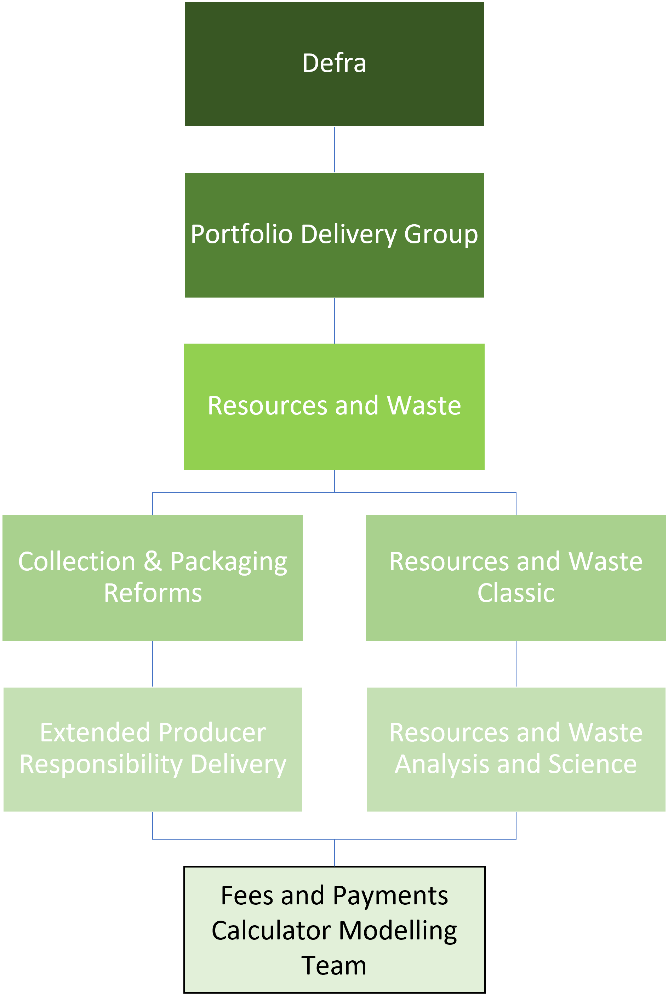

We are one of five teams within the Fees and Payments Calculator modelling team.

1.  Module A - Producer Fees
2.  Module B1 - LA Costs
3.  Module B2 - Binned Waste
4.  QA
5.  Readiness Team

For more info, see slide 5 on the [R&WE organogram](https://defra.sharepoint.com/:p:/t/Team419/ET9BduVb5n1KoY1MRh_HzIgBpMcze0Na0iz3Zdlg0Xnljw?e=BgFqbk&CID=400146ED-B571-496F-BA2F-ED9010488AF3&wdLOR=c7120BEFD-55C0-4AC6-B916-B17122625B69).

The below provides an idea of where we sit within Defra:

For further detail, please see the [Defra](https://defra.sharepoint.com/sites/Defraintranet/SitePages/Organisational-chart.aspx) and [CPR](https://defra.sharepoint.com/teams/Team1478/Central%20PMO/Forms/AllItems.aspx?csf=1&web=1&e=40pAnJ&cid=6748e449%2Da960%2D4705%2D9694%2D022465844f7d&RootFolder=%2Fteams%2FTeam1478%2FCentral%20PMO%2F06%2E%20Resourcing%2F03%2E%20Resource%20%26%20Waste%20People%20%26%20Resourcing%2F1%2E%20Org%20Charts&FolderCTID=0x012000A44110381EB3CB4C816BD7BB43BEA974&OR=Teams%2DHL&CT=1692001571358&clickparams=eyJBcHBOYW1lIjoiVGVhbXMtRGVza3RvcCIsIkFwcFZlcnNpb24iOiIyNy8yMzA3MDMwNzMzMCIsIkhhc0ZlZGVyYXRlZFVzZXIiOmZhbHNlfQ%3D%3D) organisational charts.
